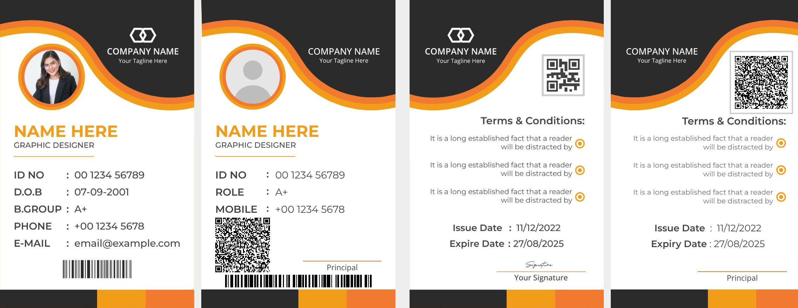

# ID Card Generator

A single-page web app that makes ID cards in the orange/black reference design.
It needs no login and no server, and works offline. All data stays in the
browser (IndexedDB).

## Run it

Open `index.html` in Chrome, Edge or Firefox. Double-clicking the file works. You
can also serve the folder (for example `python3 -m http.server`) or host it on
GitHub Pages. All libraries and fonts are bundled in `lib/` and `js/fonts.js`,
so the app needs no internet.

## How to use

1. **College profile.** Click **+ New college** (or **Add demo college** to try it).
   Fill in the logo, college name, event heading, ID prefix, terms (one point per
   line), issue/expiry dates, principal signature and seal. Changes save
   automatically and update every card of that college instantly. The card
   labels (ID NO, ROLE, "Principal", …) can also be edited under *Card labels*.
2. **Members.** Add a member with the form (name, designation, role, mobile,
   photo). The ID number is generated automatically, for example `SUE2026-001`,
   and you can edit it. The **Live card preview** shows the card as you type.
   Each row of the list has Preview, Edit, Delete and **Download ID Card**
   (JPG or PDF).
3. **Excel import.** Open *Import from Excel*, click **Download sample Excel**,
   fill it in (`Name, Designation, Role, Mobile, Photo File Name`), choose the
   file, then upload all photos at once. Photos are matched to rows by file name.
   The preview lists every row with problems (missing name, bad mobile number,
   photo not found). Only valid rows are imported.
4. **A4 sheets.** Pages appear automatically below the list: 4 members per A4
   page, each row has the front on the left and the back on the right, in list
   order. **Download in A4** saves one page and **Download all pages** saves one
   multi-page PDF.

## Output details

- **Single card JPG:** front and back side by side, about 520 DPI at real CR80
  size (54 × 85.6 mm). The DPI is written into the file.
- **Single card PDF:** 2 pages at exact CR80 size (front, back), ready for PVC
  card printers.
- **A4 PDF:** at real CR80 size, 4 rows of cards do not fit on A4 with cutting
  gaps, so the cards are scaled to the largest size that fits:
  **41.3 × 65.5 mm**, same shape. Margins and gaps are equal. The page has
  dashed cut lines with scissors and crop marks at every card corner.
- **QR code:** real QR, error correction M. It holds the member's details as
  plain text (name, designation, role, mobile, ID, college, event, issue and
  expiry date), so any phone camera shows them without internet. The front and
  back carry the same QR.
- **Barcode:** real Code 128 of the ID number.

Print the A4 sheet at **100% / "Actual size"** (not "Fit to page"). Use a
600 DPI or better printer setting so the small QR on the A4 sheet stays
scannable.

## Files

| Path | What it is |
| --- | --- |
| `index.html`, `css/style.css` | Page and styles (the card styles are at the top of the CSS) |
| `js/card.js` | Card layout, text auto-fit, QR and barcode rendering |
| `js/card-shapes.js` | Header wave shapes traced from the reference image |
| `js/export.js` | JPG / PDF / A4 export, cut lines and crop marks |
| `js/app.js` | UI: profiles, members, Excel import, previews |
| `js/db.js` | IndexedDB storage |
| `js/fonts.js` | Montserrat and Open Sans embedded as base64 (built by `tools/build-fonts.py`) |
| `lib/` | SheetJS, qrcode-generator, JsBarcode, html-to-image, jsPDF |
